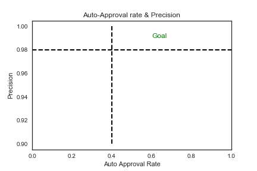
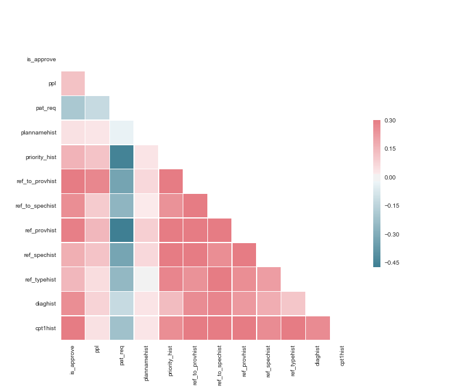
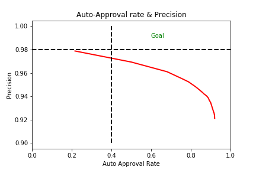
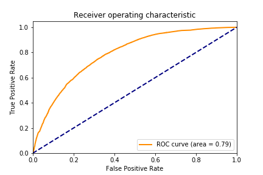
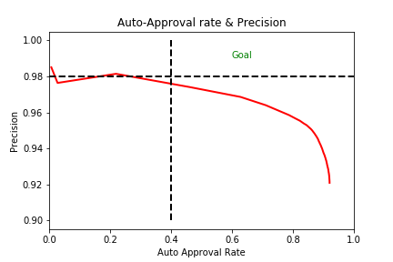
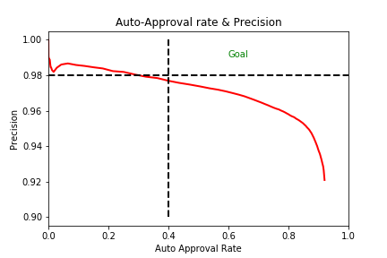
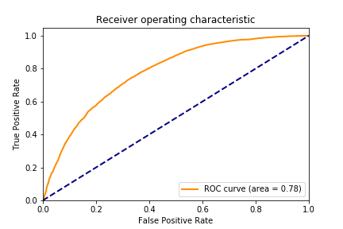
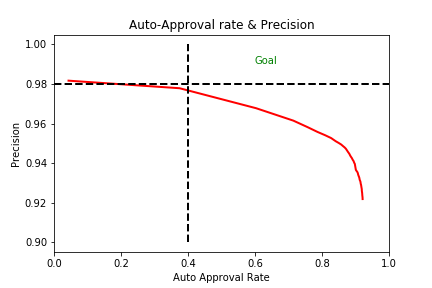

## Referrals Approval Classifier

#### Background
A medical provider group reviews and approves or denies over 2 million referrals each year. It is costly to review each referral, so the group "auto-approves" 30% of all referrals from certain specialties when specific care is requested. There is appetite to increase the auto-approval rate to 40-50%, but approving a referral that should be denied is costly.

Increasing the auto-approve rate would lower costs for the medical group, and decrease the time to return decisions to patients.

**Question:** Can a logistic model increase the auto-approval rate while keeping 'false positives' low?

#### Summary -- Approach

Several Logistic Regression models were fit to training data and tuned with validation data. The best model was then applied to previously unseen test data to assess model's ability to predict.

#### Summary - Findings

Presently no logistic regression models are able to achieve the predictive power required for deployment. Other algorithms like Random Forest or Naive Bayes could be applied as next steps.

## Table of Contents
1. [Measures of Success](#measures-of-success)
2. [Data](#data)
      * [Feature Engineering](#feature-engineering)
      * [Training, Validation and Test
Sets](#training,-validation-and-test-sets)
3. [Logistic Regression Models](#logistic-regression-models)
4. [Results](#results)
5. [Future Directions](#future-directions)

## Measures of Success

1. Area under the receiver operation characteristc curve (AUC-ROC)
2. Precision at 40% auto approval rate

At present the auto-approval rate for referrals is 30% - a new model would need to approve at 40% to be worth the implementation effort. The model also needs to be precise - to have very few false positives.  This is because approving referrals that would normally be denied could be costly - worse, it could be for a treatment that isn't medically necessary for the patient.


<sub><b>Figure: </b> Success is precision > 98% while auto-approvals are greater than 40%. </sub>

## Data

Over two million referrals placed by physicians for patients to see a specialist during the 2017 calendar year.


#### Data Dictionary

Name | Variable Name | Description | Type
------|----------|--------|----
**Approve** (target) | is_approve | 1 if referral approved, else 0 | bin
Date Received | dater | time / date stamp of when referral received | date
Registration Date | regdate | Date when the member registered with plan | date
Sex | is_male | 1 if male, else 0 | bin
Age | age | integer age of patient | int
Priority | priority_ | Physicians can indicate "Routine", "urgent", "emergency" | cat (4)
Patient Request | pat_req | 1 if patient requested the referral, else 0 | bin
Referring Physician | ref_prov | name of physician submitting the referral | cat (4000)
Refer "To" Physician | ref_to_prov | name of physician received the referral | cat (10000)
Specialty | ref_to_spec | E.g. "Cardiology", "Dermatology" | cat (50)
Procedure Code | cpt1, cpt2 ... | What is being requested in the referral | cat (14000)

*HIPAA Note: all personal information was scrubbed from the data prior to use.  Age and sex are available for each referral, but the data contain no keys to tie referrals to patients.*

#### Correlations Between Target and Predictors


<sub><b>Figure: </b> Correlations between approvals and predictors. </sub>

#### Feature Engineering

* Categorical predictors were translated to continuous variables through the following steps:
  * Using training data, historical averages of the target variable were calculated *for each level*. For example, in the ref_to_spec column, "Cardiology" is one of 50 levels and historically approve at 96%.
  * In a new column, the historical averages are transcribed for each level.

It is important to engineer the features from "historical" data in order for the classifier to be viable.

#### Training, Validation and Test Sets

The purpose of the model is to predict whether future approvals with auto-approval or not.  As such, referrals were divided into training, validation, and test sets per the table below.
* training data - Jan - Aug, 2017
* validation data - Sept, 2017
* test data - Oct - Dec, 2017

## Logistic Regression Models


#### Model 1 - Refer To Provider Only

The physician to whom the referral is directed may explain whether a referral will approve or deny. Referrals to some specialties approve at lower rates, and there is some variation in the historical approval rates made to providers.

```
Hypothesis:
log odds of approval = X1 + refer_to_prov * X2 + e
```

**Model 1 Performance**





#### Model 2 - Refer To Provider & CPT code

Adds "cpt code 1" to Model 1. CPT codes indicate what service, procedure, or action the receiving physician should perform. It is well known that some routine services (like an office visit) approve at very high rates. Others approval at lower rates and so we hypothesize it will be predictive.

```
Hypothesis:
log odds of approval = X1 + refer_to_prov * X2 + cpt1hist * X3+ e
```




#### Model 3 - Logistic - L1 Penalty (C = 0.3)

The L1 penalty is means of regularization like the lasso. It helps to avoid overfitting when dimensions increase. In this model all variables are considered.




#### Model 4 - All variables, y-undersampled

The classes in the target are imbalanced, so models can be prone to simply predict the majority class and be correct, in this case, 92% of the time. To ensure the model considers both classes equally likely, in this model we undersample "approvals" to be 50% of the training set.




#### Model 2 on Test Data

When tested on our validation (September) data Model 2 performed the best. Applying the model to previously unseen data we see from our performance measures that the model generalizes well.







```
log odds of approval = -7.7 + 6.68 * ref_tohist + 4.8 * cpt1hist
```

## Results

None of the models met the 98% precision level at the 40% auto approval rate.

Num | Model | ROC-AUC | Precision at 40% AA
---|----|-----|----
1 | Logistic - Referring Provider | 0.76 | 97.1%
2 |Logistic - Refer To Provider, CPT1 | 0.79 | 97.7%
3 | Logistic w/ penalty (lasso, C=.3), all vars | 0.79 | 97.5%
4 |Logistic, all vars, y-undersampled | 0.79 | 97.6%
Test | Logistic - Refer To Provider, CPT1| 0.78 | 97.6%

## Future Directions

* Use the 2nd, 3rd, 4th, etc. CPT codes.  
* Use number of CPT codes as a feature.
* Machine earning with Profit Curve to focus on precision - LogisticRegression CV()?
* Switch approve = 1 to denial = 1
* SMOTE or other balancing
* Use models that can work on sparse matricies, and One Hot Encode the categorical variables.
